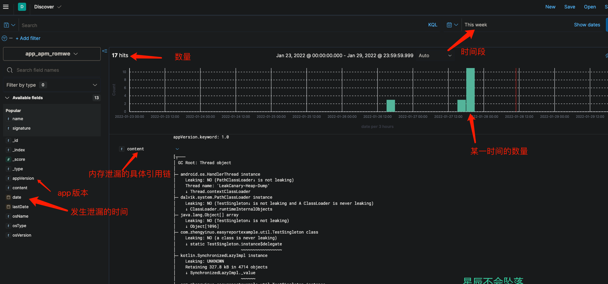

## 简介

用于APP性能监控数据的上报

内存泄漏，卡顿(慢函数)，启动耗时，大图检测

## 开始

### 依赖导入

build.gradle

`implementation 'com.github.guixin567:easyreport:1.0'`

setting.gradle

```
repositories{
		...
    maven{url 'https://jitpack.io'}
}
```

### 代码接入

内存泄漏上报

```kotlin
LeakCanary.config = LeakCanary.config.run {
            copy(
                eventListeners = eventListeners + EventListener { event ->
                    if (event is EventListener.Event.HeapAnalysisDone.HeapAnalysisSucceeded) {
                        val appVersion = AppUtil.getAppVersion(this@MyApp)
                        val osVersion = AppUtil.getSystemVersion()
                        val osName = AppUtil.getSystemModel()
                        val datas =  event.heapAnalysis.applicationLeaks.map {
                            MemoryEntity().apply {
                                signature = it.signature
                                this.appVersion = appVersion
                                this.osVersion = osVersion
                                this.osType = "Android"
                                this.osName = osName
                                this.name = it.leakTraces[0].leakingObject.classSimpleName
                                this.content = it.leakTraces.toString()
                            }
                        }
            		//将泄漏的数据上报到后台
                        EasyApp.instance.reportLeak(datas)
                    }
                }
            )
        }
```

### 数据展示

example 泄漏场景


kibana 内存泄漏



